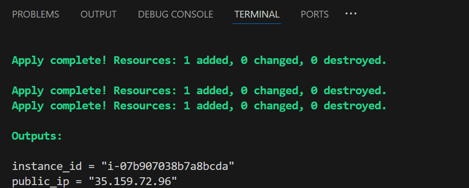
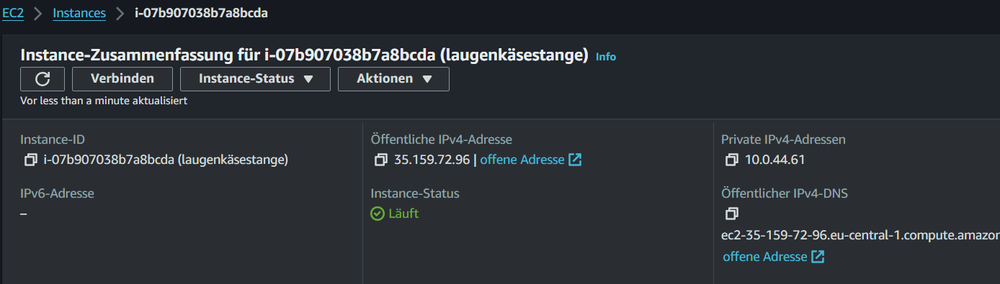
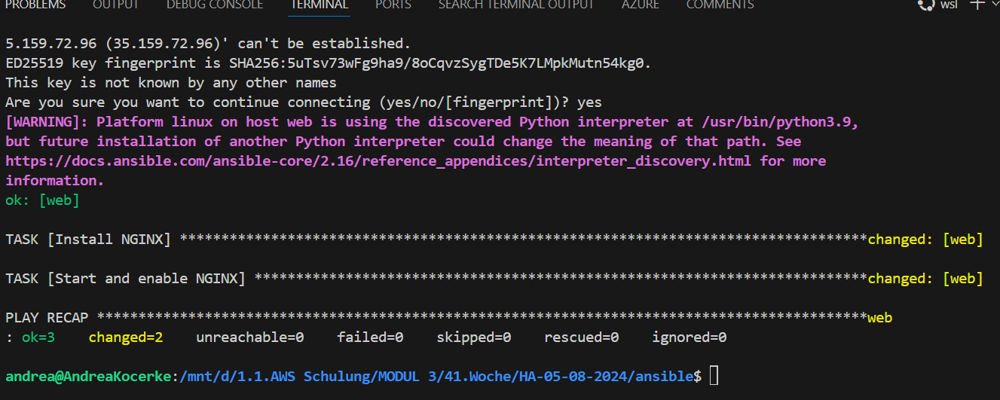
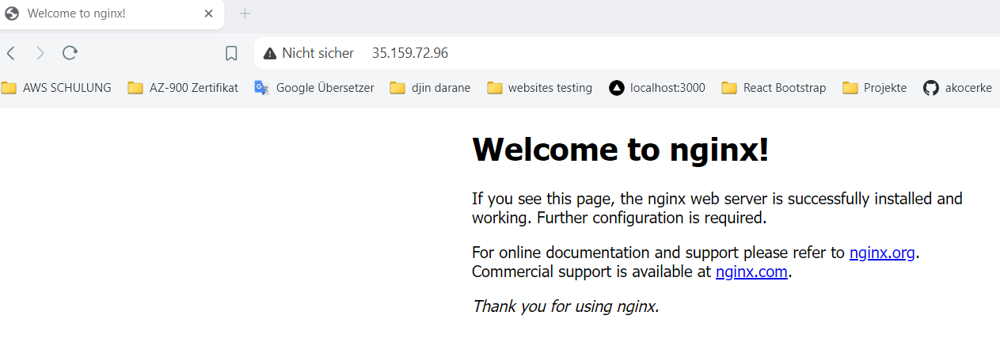
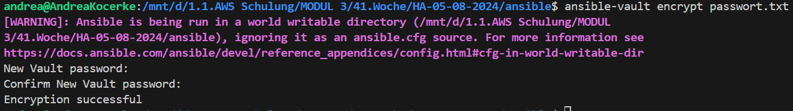
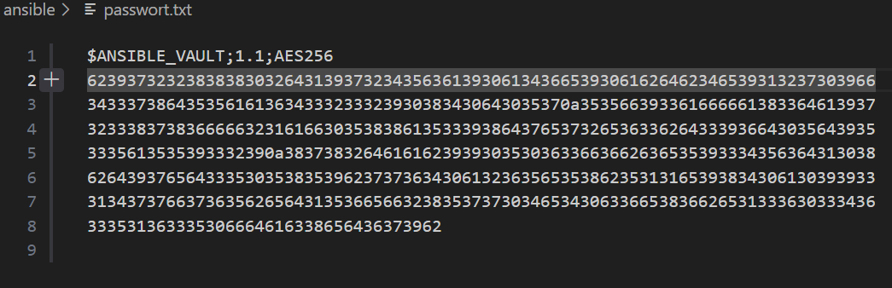
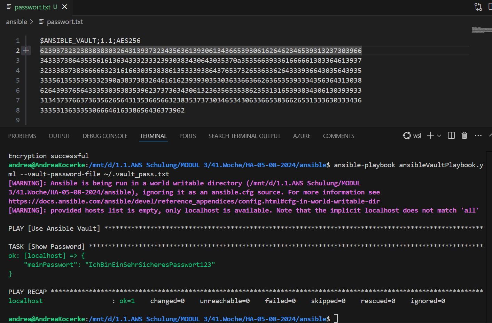

# HA-05-08-2024
wir üben noch
---

# Aufgabe: 1
Erstellt 2-5 Ec2 Instanzen✅
#### mit terraform



#### überprüfunh in der aws management


- Erstellt eine .ini Datei ( z.B hosts.ini) und fügt die neu erstellten  ec2-instanzen  hinzu:✅

    Beispiel: ec2-instance-2 ansible_host=35.158.184.184 ansible_user=ec2-user ansible_ssh_private_key_file=~/.ssh/testec2sshkey.pem 

- Nehmt gerne meine playbook.yml-Datei✅ oder erstellt eine eigene und führt diese aus. 
    Am besten erstellt ihr ein Playbook, in dem ihr erstmal nur etwas installiert.
    Abgabe:
    Commit & Screenshot von dem Ergebnis im Terminal 


    

    #### public_ip nginx server
    

# Aufgabe 2: 
Erstellt wie im Unterricht eine .txt Datei mit einem Key-Value Pair ( bspw. secretPasswort:     IchBinEinSehrSicheresPasswort123)

- Verschlüsselt diese Datei mit ansible-vault
    
    

- Erstellt ein zweites Playbook✅, in dem ihr diese Datei auslest und den Inhalt in der Konsole anzeigt (nehmt euch ein Beispiel an meinem zweiten Playbook ( ansibleVaultPlaybook.yml)
Abgabe: 
Screenshot von der verschlüsselten Datei und das Ergebnis im Terminal (wo man das Passwort dann sieht).


# Zusatzaufgabe:
Erstellt eine Ansible.cfg Datei und recherchiert nach, was man dort als Konfiguration auslagern kann. Einige Beispiele findet ihr in meiner ansible.cfg-Datei.


#### Beispiel `ansible.cfg` Datei:

```
[defaults]
host_key_checking = False
remote_user = ec2-user
inventory = hosts.ini
```

1. **`host_key_checking`**: 
   - **Beschreibung**: Diese Option deaktiviert die Überprüfung des Host-Keys, wenn Ansible sich mit einem SSH-Host verbindet. Normalerweise überprüft SSH die Identität des Hosts anhand seines Schlüssels, um sicherzustellen, dass man sich nicht mit einem falschen oder bösartigen Host verbindet. Wenn `host_key_checking` auf `False` gesetzt ist, überspringt Ansible diese Überprüfung.
   - **Verwendung**: Dies kann nützlich sein, wenn man oft mit neuen Hosts arbeitet, die man nicht in der `known_hosts`-Datei hat, oder in Testumgebungen. Stellt aber ein Sicherheitsrisiko dar.

2. **`remote_user`**:
   - **Beschreibung**: Dies gibt den Standardbenutzer an, der für SSH-Verbindungen verwendet wird. In dem Fall ist es `ec2-user`, der häufig bei Amazon EC2-Instanzen verwendet wird.
   - **Verwendung**: Dies spart die Notwendigkeit, bei jedem Playbook oder jeder Ansible-Task den `remote_user`-Wert anzugeben. Er wird automatisch verwendet, wenn keine andere Benutzerkonfiguration vorliegt.

3. **`inventory`**:
   - **Beschreibung**: Dies gibt den Pfad zur Inventardatei an, in der die Hosts und Gruppen definiert sind, auf die Ansible zugreifen soll. In dem Fall ist es `hosts.ini`.
   - **Verwendung**: Hier gibt man den Speicherort der Inventardatei an, die Ansible verwenden soll. Diese Datei enthält Informationen über die Maschinen, die man verwalten möchte.

### Erweiterungsmöglichkeiten

Je nach seinen Bedürfnissen kann man weitere Konfigurationsoptionen in der `ansible.cfg`-Datei hinzufügen. Hier sind einige Optionen:

- **`vault_password_file`**: Für Ansible Vault Passwörter.
  ```ini
  vault_password_file = /path/to/.vault_pass.txt
  ```

- **`roles_path`**: Pfad zu den Ansible-Rollen.
  ```ini
  roles_path = /path/to/roles
  ```

- **Sicherheit**: Immer darauf achten, dass sensible Daten wie Passwörter und private Schlüssel sicher aufbewahrt und nicht in öffentlich zugängliche Repositories hochgeladen werden.

- **Versionskontrolle**: Nutze Versionskontrollsysteme, um Änderungen an deiner `ansible.cfg`-Datei nachverfolgen zu können und verschiedene Konfigurationen für unterschiedliche Umgebungen zu verwalten.

- **Dokumentation**: Kommentieren von Konfigurationsdateien, um klarzustellen, was jede Option bewirkt und warum sie gesetzt wurde.
